# 🏰 ObbyDefenderGame

<div align="center">


**Защити свою базу от волн итальянских животных в этой Tower Defense игре по мотивам Роблокс!**

[О проекте](#-о-проекте) • [Особенности](#-особенности) • [Технический стек](#-технический-стек) • [Установка](#-установка) • [Старт игры](#-старт-игры) • [Видео](#видео-геймплея) • [Скриншоты](#скриншоты)

</div>

---

## 📖 О проекте

**ObbyDefenderGame** - это увлекательная Tower Defense игра, разработанная на Unity, где игроку предстоит защищать свою базу от непрерывных волн врагов, стратегически размещая различные типы башен и улучшая их характеристики.

### 🎯 Основная цель
Не дать врагам пройти по пути и добраться до вашей базы, используя оружие героя и установку защитных турелей.

## ✨ Особенности

### 🎮 Геймплей
- **Турели** - защищают базу от врагов
- **Система улучшений** - прокачивайте башни и героя для увеличения урона, скорости атаки и здоровья
- **Разнообразные враги** - от быстрых легких юнитов до медленных танков с большим запасом здоровья и дальними атаками
- **Система волн** - с каждой волной враги становятся сильнее и многочисленнее.
- **Экономическая система** - зарабатывайте монеты за уничтожение врагов и тратьте их на новые апгрейды

### 🛠️ Технические особенности
- Оптимизированы модели для плавного геймплея.
- Адаптивный UI с анимациями.
- Анимации и партиклы для геймлея.
- Система сохранения и загрузки прогресса в файл.
- Поддержка различных разрешений экрана.
- Загрузка приложения со сцены запуска.
- Отдельная сцена для мета прогрессии
- Балансировщик волн и генератор волн. Рост сложности по кривой интереса
- Награда за волны зависит от сложности сгенерированных волн

## 🚀 Технический стек

### Основные технологии
- **Unity 6.0** 
- **C#** - основной язык программирования
- **Rider** - IDE
- **Атомарный подход** - для кор механик
- **Zenject** - DI container. Внедрение зависимостей
- **Игровой цикл** - контроль состояния игры
- **MVX паттерны** - UI игры.
- **DoTween** - анимация UI.

### Архитектура проекта
```
ObbyDefenderGame/
├── Assets/
│   ├── _project/
│   │   ├── AppRunner/                  # Логика запуска приложения
│   │   ├── Debug/                      # Дебаг классы
│   │   ├── DI/                         # Внедрение зависимостей. Контексты сцен и приложения.
│   │   ├── GameCycle                   # Игровой цикл приложения
│   │   ├── Utils/                      # Вспомогательные скрипты
│   │   ├── Input/                      # Инпут система
│   │   ├── SaveLoad System/            # Система сохранения и зрагузки
│   │   ├── Scenes/                     # Игровые сцены
│   │   ├── Timers/                     # Реализация базовых таймеров
│   │   ├── Game/                       # Реализация базовых механик
│   │   │       ├── Atomic/             # Реализация атомарных механик
│   │   │       ├── Base/               # Фича базы, которую охраняем
│   │   │       ├── BrainrotAnimals/    # Все что связано с врагами - животными
│   │   │       ├── Coins/              # Механика монет
│   │   │       ├── CoreGameEnding/     # Отслеживание окончания игры
│   │   │       ├── Detection/          # Сенсоры и обсерверы 
│   │   │       ├── Hero/               # Главный персонаж и его настройки 
│   │   │       ├── LoadSceneTrigger/   # Триггер загрузки сцены 
│   │   │       ├── Services/           # Игровые сервисы
│   │   │       ├── Turrets/            # Фича турелей
│   │   │       ├── UpgradeSystem/      # Система апгрейдов
│   │   │       ├── WavesSystem/        # Система волн и их балансировка
│   │   │       ├── Weapons/            # Оружие, пули и их поведение
│   │   
└── README.md
```

## 📦 Установка

### Открытие в Unity
1. Откройте Unity Hub
2. Нажмите "Add" и выберите папку проекта
3. Откройте проект в Unity Editor
4. Дождитесь импорта всех ассетов

## 🎮 Старт игры

### Запуск игры 
- **Загрузка приложения через сцену AppStarter**

### Управление
- **WASD** - перемещение


## Почему выбран такой стиль и тема проекта

- На момент выполнения проекта, ниша итальянских животных имела резкий рост и была в тренде + Обби устаявшийся тренд.
- Так как игра ориентировалась на детскую аудиторию и веб площадку: подобранные визуальный стиль и ниша были оправданы.
- Скриншоты популярности трендов

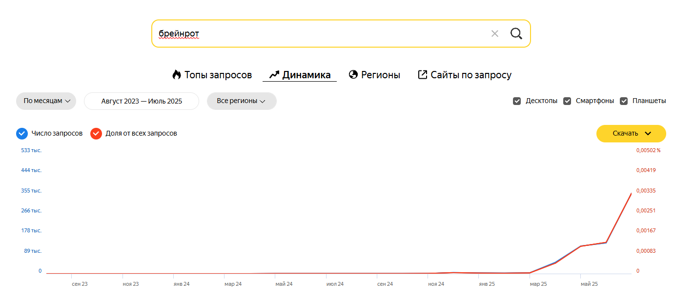
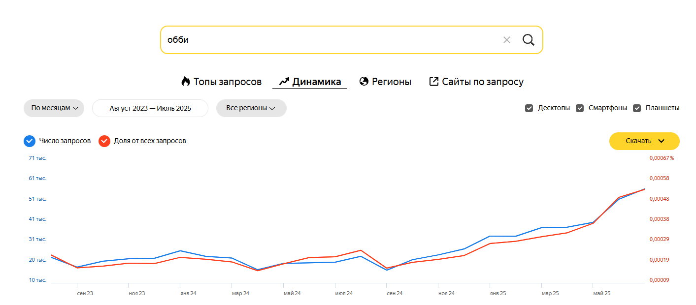


## Видео геймплея
[Смотреть видео на YouTube](https://youtu.be/0aQq6D4eT-s)

## Скриншоты
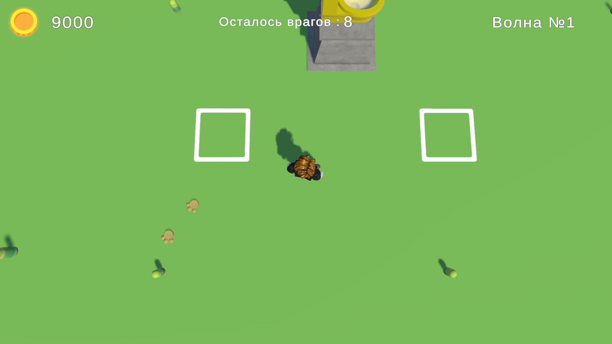
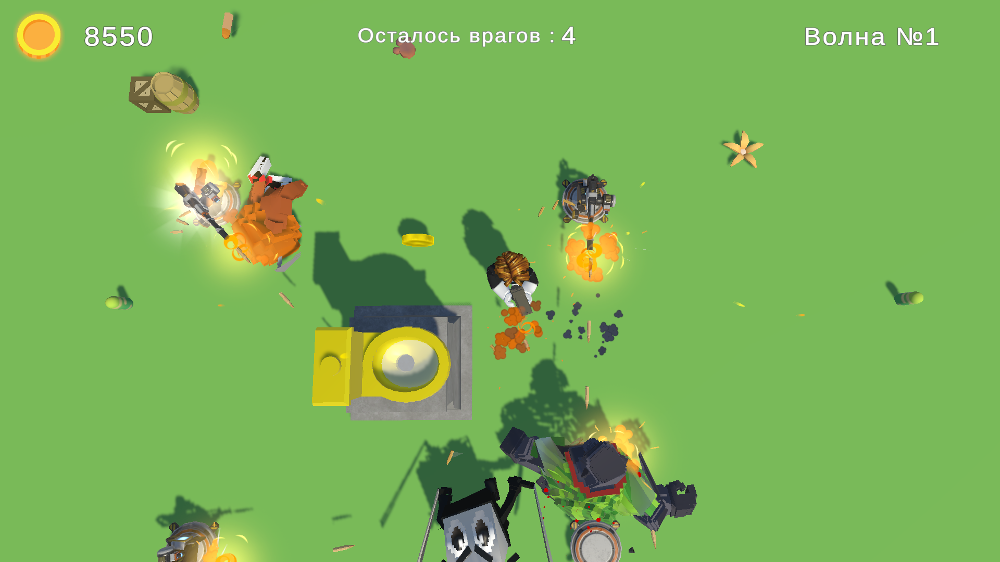
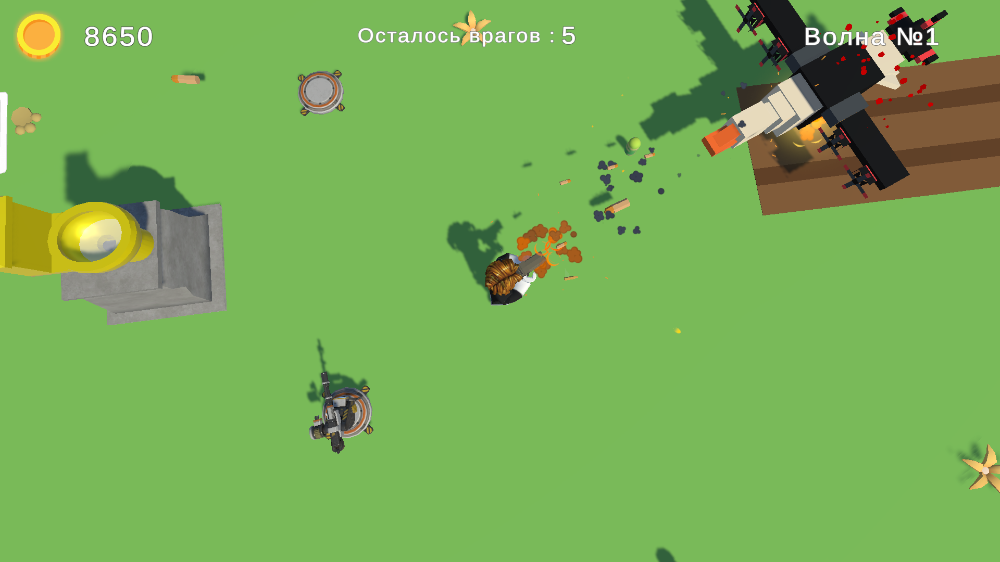
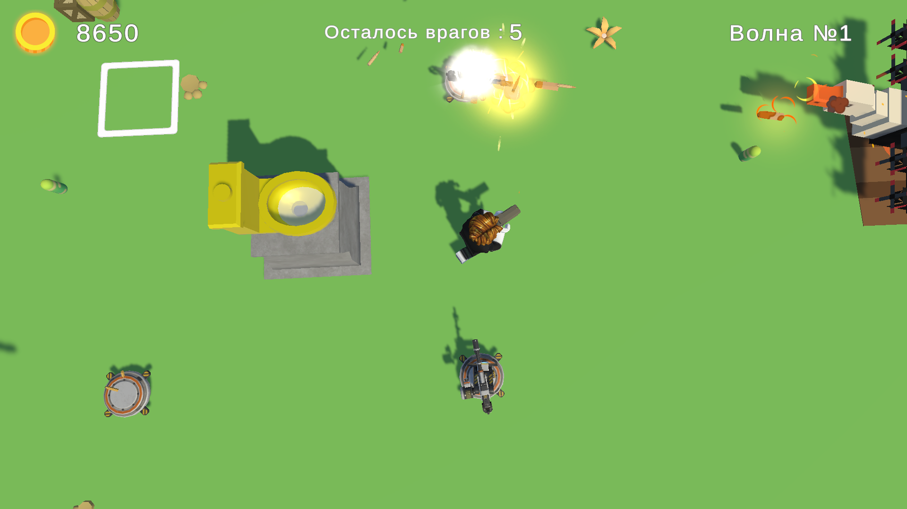
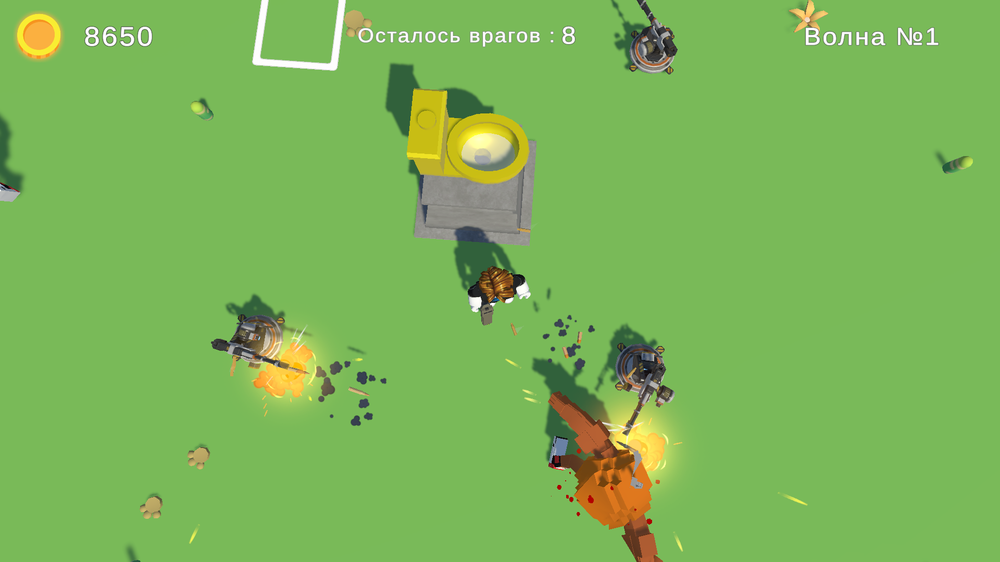
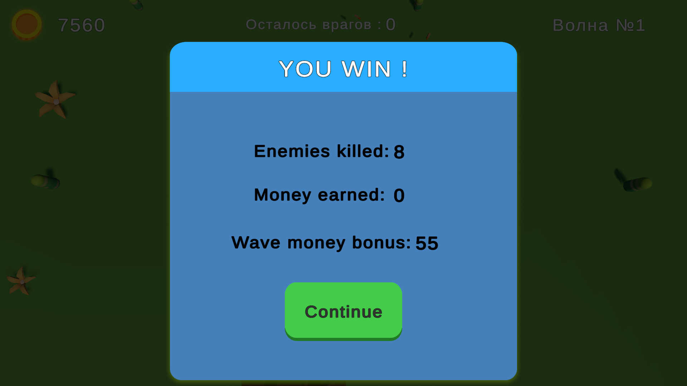
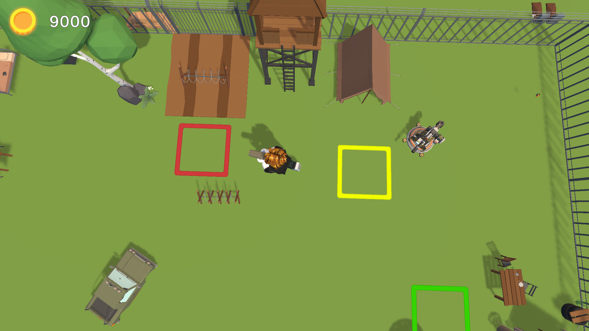
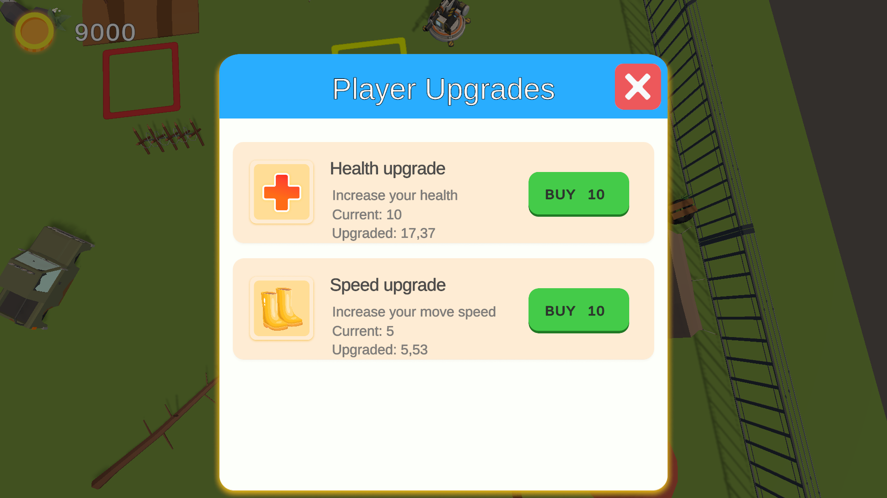
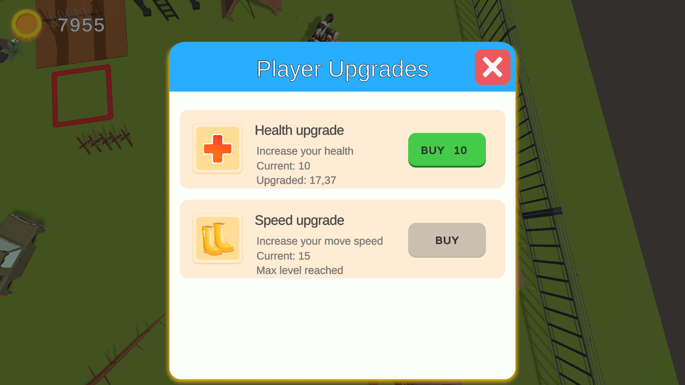
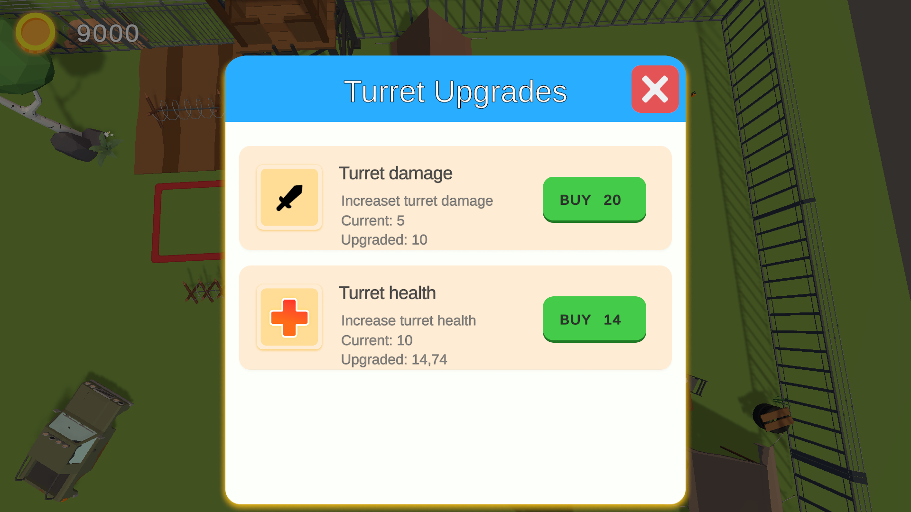

## 📧 Контакты

По вопросам и предложениям обращайтесь:
- Email: egorbogd12@gmail.com

---

<div align="center">

**Сделано с ❤️ для любителей Tower Defense игр**

⭐ Если вам понравился проект, поставьте звезду на GitHub! ⭐

</div>
